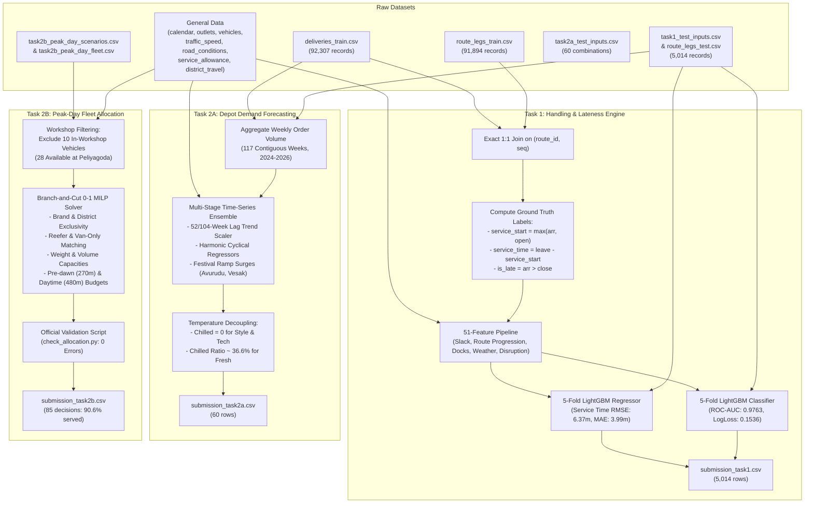
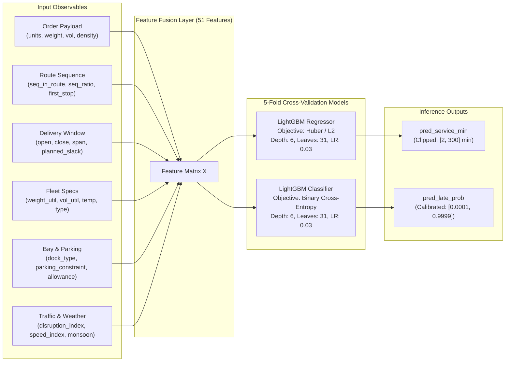
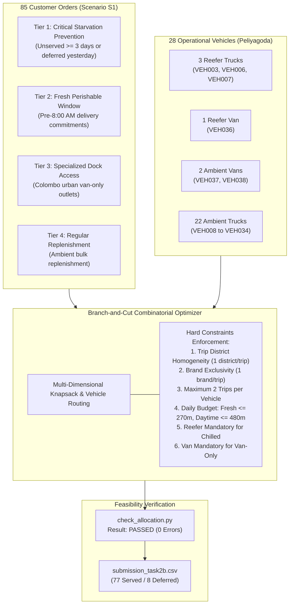

# Nexio Logistics: System Architecture & Workflow Diagrams

**Competition:** Tech-Triathlon 2026 (Rootcode) — Datathon Phase  
**Team:** Nexio  
**Date:** October 9, 2026  

---

## 1. High-Level Data & Solution Pipeline

---

## 2. Task 1 Predictive Intelligence Architecture

---

## 3. Task 2B Peak-Day Allocation Solver Architecture

