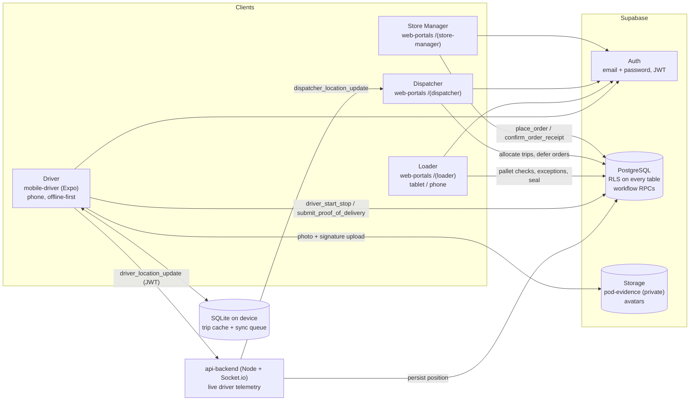

# Architecture

Waypoint connects ordering, planning, loading, delivery and receipt across four roles.
Supabase is the single source of truth for data, authentication and file storage.

## Components

| Component | Tech | Responsibility |
|---|---|---|
| `web-portals/` | Next.js 16 (App Router), Tailwind v4, `@supabase/ssr` | Role-based portals for dispatcher, loader and store manager. `middleware.ts` checks the Supabase session and routes each role to its own route group. |
| `mobile-driver/` | Expo SDK 57, expo-router, expo-sqlite, zustand | Driver itinerary, stop detail, proof of delivery (photo + signature), offline queue that syncs when connectivity returns. |
| `api-backend/` | Node.js, Express, Socket.io | Authenticated WebSocket relay for live driver GPS → dispatcher tracking map; persists last position on the trip. |
| Supabase | Postgres, Auth, Storage | Data, row level security, workflow RPCs, file storage. |
| `migrations/`, `seeds/`, `scripts/` | SQL + Node | Schema, demo data, demo accounts. |

## How a delivery flows through the system

1. **Order** – the store manager calls `place_order`. The database enforces the 16:00 cutoff for next-day delivery (Asia/Colombo).
2. **Plan** – the dispatcher assigns orders to vehicles and trips while respecting weight, volume, temperature, van-only access and delivery windows. Orders that do not fit are deferred with a reason in `deferral_logs`, which the store sees as an alert.
3. **Load** – the loader works through the trip's pallets in reverse stop order, flags shortfalls (`exceptions`) and seals the vehicle (`loading_logs`).
4. **Deliver** – the driver app downloads only the signed-in driver's trip into SQLite. Every action is queued locally first, then synced: photos and signatures go to the private `pod-evidence` bucket and `submit_proof_of_delivery` records the outcome. The RPC is idempotent per stop, so retries after a dropped connection are safe.
5. **Receive** – the store manager sees the driver's proof of delivery and calls `confirm_order_receipt`. Any shortfall or damage creates an `exceptions` row for dispatch.

## Security model

- **Authentication**: Supabase Auth (email + password) for every role. No custom OTP or token scheme.
- **Authorisation in the database**: every public table has row level security. `SECURITY DEFINER` helper functions (`auth_role()`, `auth_store_id()`, `is_my_trip()` …) keep policies non-recursive.
  - Drivers can read only their own trips, stops and the orders on them.
  - Store managers can read only their own store's orders, stops, deliveries and receipts.
  - Dispatchers and loaders can read operational data. Only dispatchers can change orders, trips and stores.
- **Writes go through RPCs** for the store and driver workflows, so clients can never set columns they do not own (for example a driver cannot mark another driver's stop delivered).
- **Profiles**: a trigger blocks users from changing their own `role` or `store_id`.
- **Storage**: POD files live at `<driver id>/<stop id>/…` in a private bucket. Only that driver can upload. Read access is limited to staff, the driver and the receiving store.
- **Server routes** that use the service key verify the caller's session and role first. The service key is never shipped to a client.
