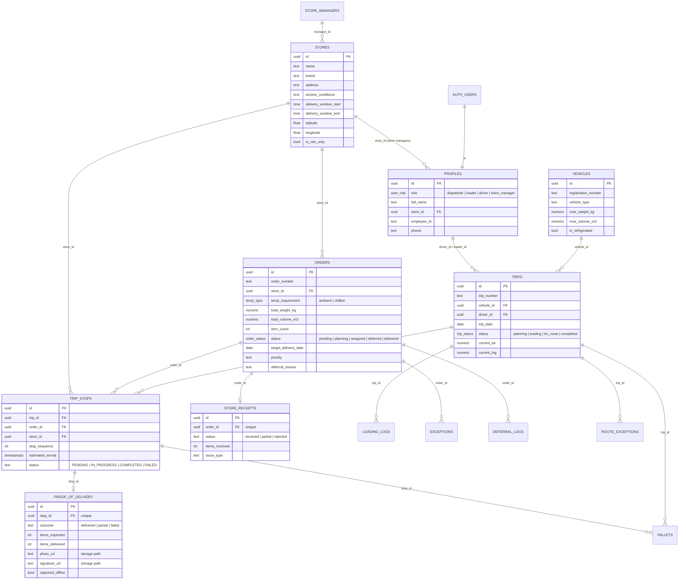

# Data model

All tables live in the Supabase `public` schema and have row level security enabled.
Schema changes are versioned in [`migrations/`](../migrations); demo data in [`seeds/`](../seeds).

## Workflow functions (RPC)

| Function | Caller | What it does |
|---|---|---|
| `place_order(...)` | Store manager | Creates an order for the caller's store. Enforces the 16:00 next-day cutoff and positive quantities. |
| `driver_start_stop(stop_id)` | Driver | Marks a stop on the caller's own trip as in progress. |
| `submit_proof_of_delivery(...)` | Driver | Records the POD (idempotent per stop), completes the stop, marks the order delivered and closes the trip when no stops remain. |
| `driver_update_location(trip_id, lat, lng)` | Driver | Stores the latest position for live tracking. |
| `confirm_order_receipt(...)` | Store manager | Confirms what arrived. A partial or rejected receipt raises an exception for dispatch. |

## Offline storage on the driver's phone

The Expo app keeps an SQLite copy of the driver's current trip and a `sync_queue` table.
Each queued record (stop started, proof of delivery, location) is replayed against the RPCs above when the device is online again.
